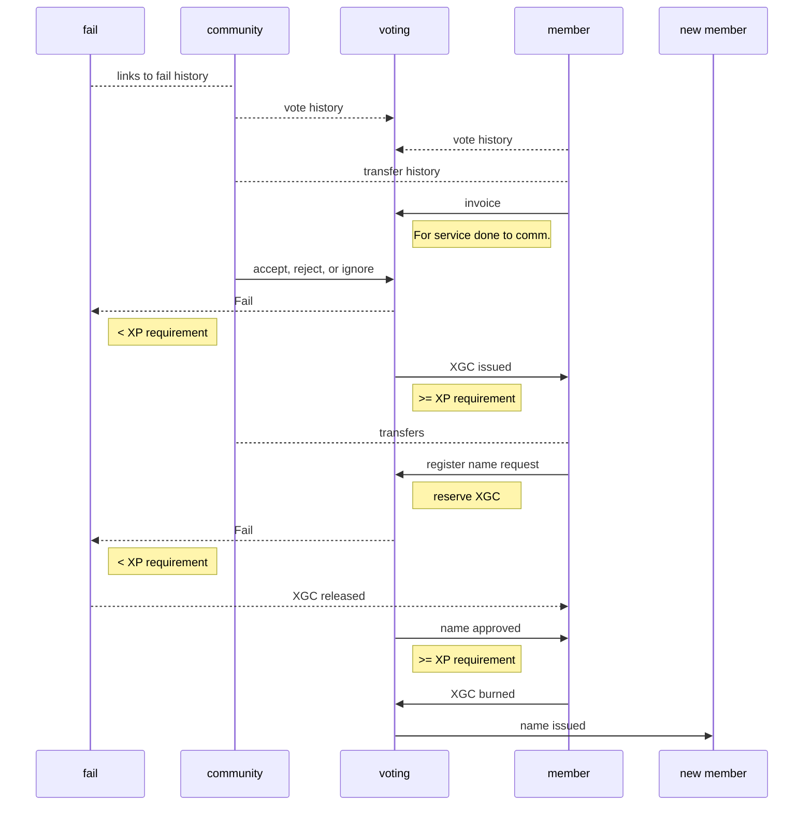

# Guld Coin

__XGC__

XGC represent the limited namespace available on the blocktree, and are redeemable for individual or community guld membership fees. XGC are transferable to any other active guld member.

### Governance

Guld coin (abbreviated XGC) is a digital token governed by the guld community. Neither this agreement, nor the XGC ledger may be changed in any way without approval of no less than 85% of outstanding XP.

### Lifecycle

##### Issuance

XGC may be issued for any member-approved service contract to the guld community. This includes, but is not limited to, [contributors](gap://legal/contract/agreement/contributor.md), [maintainers](gap://legal/contract/agreement/maintainer.md), [ambassadors](gap://legal/contract/agreement/ambassador.md), and [advisors](gap://legal/contract/agreement/advisors.md).

##### Redemption

XGC may be redeemed for registering a name on the `life` or `community` branches of the blocktree.

| Type | Fee | Approval |
|------|-----|----------|
| individual | 1 XGC | 1 member |
| community | 10 XGC | 50% XP |
